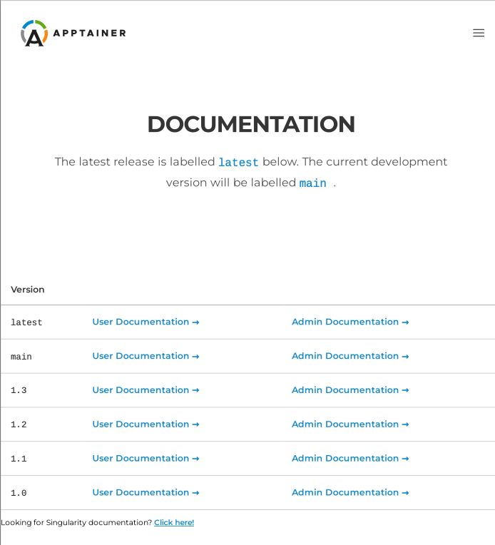

.. _running_services:

################
Running Services
################

There are :ref:`different ways <runcontainer>` in which you can run
{Project} containers. If you use commands like ``run``, ``exec`` and
``shell`` to interact with processes in the container, you are running
{Project} containers in the foreground. {Project}, also lets you
run containers in a "detached" or "daemon" mode which can run different
services in the background. A "service" is essentially a process running
in the background that multiple different clients can use. For example,
a web server or a database. To run services in {aProject} container
one should use *instances*. A container instance is a persistent and
isolated version of the container image that runs in the background.

********
Overview
********

.. _sec:instances:

{Project} has the concept of *instances* allowing users
to run services in {Project}. This page will help you understand
instances using an elementary example followed by a more useful example
running an NGINX web server using instances. In the end, you will find a
more detailed example of running an instance of an API that converts URL
to PDFs.

To begin with, suppose you want to run an NGINX web server outside of a
container. On Ubuntu, you can simply install NGINX and start the service
by:

.. code::

   $ sudo apt-get update && sudo apt-get install -y nginx
   ...
   $ sudo service nginx start

If you were to do something like this from within a container you would
also see the service start, and the web server running. But then if you
were to exit the container, the process would continue to run within an
unreachable mount namespace. The process would still be running, but you
couldn't easily kill or interface with it. This is a called an orphan
process. {Project} instances give you the ability to handle services
properly.

************************************
Container Instances in {Project}
************************************

For demonstration, let's use an easy (though somewhat useless) example
of ``alpine_latest.sif`` from {Project}'s github container registry:

.. code::

   $ {command} pull oras://ghcr.io/apptainer/alpine:latest

The above command will save the alpine image as ``alpine_latest.sif``.

To start an instance, you should follow this procedure :

.. code::

   [command]                      [image]              [name of instance]

   $ {command} instance start   alpine_latest.sif     instance1

This command causes {Project} to create an isolated environment for
the container services to live inside. One can confirm that an instance
is running by using the ``instance list`` command like so:

.. code::

   $ {command} instance list

   INSTANCE NAME    PID      IP              IMAGE
   instance1        22084                    /home/dave/instances/alpine_latest.sif

.. note::

   The instances are linked with your user account. So make sure to run
   *all* instance commands either with or without the ``sudo``
   privilege. If you ``start`` an instance with sudo then you must
   ``list`` it with sudo as well, or you will not be able to locate the
   instance.

If you want to run multiple instances from the same image, it's as
simple as running the command multiple times with different instance
names. The instance name uniquely identify instances, so they cannot be
repeated.

.. code::

   $ {command} instance start alpine_latest.sif instance2
   $ {command} instance start alpine_latest.sif instance3

And again to confirm that the instances are running as we expected:

.. code::

   $ {command} instance list
   INSTANCE NAME    PID      IP              IMAGE
   instance1        22084                    /home/dave/instances/alpine_latest.sif
   instance2        22443                    /home/dave/instances/alpine_latest.sif
   instance3        22493                    /home/dave/instances/alpine_latest.sif

You can also filter the instance list by supplying a pattern:

.. code::

   $ {command} instance list '*2'
   INSTANCE NAME    PID      IP              IMAGE
   instance2        22443                    /home/dave/instances/alpine_latest.sif

You can use the ``{command} run/exec`` commands on instances:

.. code::

   $ {command} run instance://instance1
   $ {command} exec instance://instance2 cat /etc/os-release

When using ``run`` with an instance URI, the ``runscript`` will be
executed inside of the instance. Similarly with ``exec``, it will
execute the given command in the instance.

If you want to poke around inside of your instance, you can do a normal
``{command} shell`` command, but give it the instance URI:

.. code::

   $ {command} shell instance://instance3
   {Project}>

When you are finished with your instance you can clean it up with the
``instance stop`` command as follows:

.. code::

   $ {command} instance stop instance1

If you have multiple instances running and you want to stop all of them,
you can do so with a wildcard or the --all flag. The following three
commands are all identical.

.. code::

   $ {command} instance stop \*

   $ {command} instance stop --all

   $ {command} instance stop -a

.. note::

   Note that you must escape the wildcard with a backslash like this
   ``\*`` to pass it properly.

************************************
Nginx "Hello-world" in {Project}
************************************

The above example, although not very useful, should serve as a fair
introduction to the concept of {Project} instances and running
services in the background. The following illustrates a more useful
example of setting up a sample NGINX web server using instances. First
we will create a basic :ref:`definition file <definition-files>` (let's
call it nginx.def):

.. code:: {command}

   Bootstrap: docker
   From: nginx
   Includecmd: no

   %startscript
      nginx

This downloads the official NGINX Docker container, converts it to a
{Project} image, and tells it to run NGINX when you start the
instance. Since we're running a web server, we're going to run the
following commands as root.

.. code::

   $ {command} build nginx.sif nginx.def
   ...
   $ sudo {command} instance start --writable-tmpfs nginx.sif web

.. note::

   The above ``start`` command requires ``sudo`` because we are running
   a web server. Also, to let the instance write temporary files during
   execution, you should use ``--writable-tmpfs`` while starting the
   instance.

Just like that we've downloaded, built, and run an NGINX {Project}
image. And to confirm that it's correctly running:

.. code::

   $ curl localhost

   <!DOCTYPE html>
   <html>
   <head>
   <title>Welcome to nginx!</title>
   
   </head>
   <body>
   <h1>Welcome to nginx!</h1>
   
If you see this page, the nginx web server is successfully installed and
   working. Further configuration is required.

   
For online documentation and support please refer to
   <a href="http://nginx.org/">nginx.org</a>. 
   Commercial support is available at
   <a href="http://nginx.com/">nginx.com</a>.

   
<em>Thank you for using nginx.</em>

   </body>
   </html>

Visit localhost on your browser, you should see a Welcome message!

********************
Putting all together
********************

In this section, we will demonstrate an example of packaging a service
into a container and running it. The service we will be packaging is an
API server that converts a web page into a PDF, and can be found `here
<https://github.com/alvarcarto/url-to-pdf-api>`__. You can build the
image by following the steps described below or you can just download
the final image directly from the container registry, simply run:

.. code::

   $ {command} pull url-to-pdf.sif oras://ghcr.io/apptainer/doc-examples/url-to-pdf:latest

Building the image
==================

This section will describe the requirements for creating the definition
file (url-to-pdf.def) that will be used to build the container image.
``url-to-pdf-api`` is based on a Node 8 server that uses a headless
version of Chromium called `Puppeteer
<https://github.com/GoogleChrome/puppeteer>`_. Let's first choose a base
from which to build our container, in this case the docker image
``node:8`` which comes pre-installed with Node 8 has been used:

.. code:: {command}

   Bootstrap: docker
   From: node:8
   Includecmd: no

Puppeteer also requires a slew of dependencies to be manually installed
in addition to Node 8, so we can add those into the ``post`` section as
well as the installation script for the ``url-to-pdf``:

.. code:: {command}

   %post

       apt-get update && apt-get install -yq gconf-service libasound2 \
           libatk1.0-0 libc6 libcairo2 libcups2 libdbus-1-3 libexpat1 \
           libfontconfig1 libgcc1 libgconf-2-4 libgdk-pixbuf2.0-0 \
           libglib2.0-0 libgtk-3-0 libnspr4 libpango-1.0-0 \
           libpangocairo-1.0-0 libstdc++6 libx11-6 libx11-xcb1 libxcb1 \
           libxcomposite1 libxcursor1 libxdamage1 libxext6 libxfixes3 libxi6 \
           libxrandr2 libxrender1 libxss1 libxtst6 ca-certificates \
           fonts-liberation libappindicator1 libnss3 lsb-release xdg-utils \
           wget curl && rm -r /var/lib/apt/lists/*
       git clone https://github.com/alvarcarto/url-to-pdf-api.git pdf_server
       cd pdf_server
       npm install
       chmod -R 0755 .
       cp .env.sample .env

And now we need to define what happens when we start an instance of the
container. In this situation, we want to run the commands that starts up
the url-to-pdf service:

.. code:: {command}

   %startscript
       cd /pdf_server
       # Use nohup and /dev/null to completely detach server process from terminal
       nohup npm start > /dev/null 2>&1 < /dev/null &

Also, the ``url-to-pdf`` service requires some environment variables to
be set, which we can do in the environment section:

.. code:: {command}

   %environment
       NODE_ENV=development
       PORT=9000
       ALLOW_HTTP=true
       URL=localhost
       export NODE_ENV PORT ALLOW_HTTP URL

The complete definition file will look like this:

.. code:: {command}

   Bootstrap: docker
   From: node:8
   Includecmd: no

   %post

       apt-get update && apt-get install -yq gconf-service libasound2 \
           libatk1.0-0 libc6 libcairo2 libcups2 libdbus-1-3 libexpat1 \
           libfontconfig1 libgcc1 libgconf-2-4 libgdk-pixbuf2.0-0 \
           libglib2.0-0 libgtk-3-0 libnspr4 libpango-1.0-0 \
           libpangocairo-1.0-0 libstdc++6 libx11-6 libx11-xcb1 libxcb1 \
           libxcomposite1 libxcursor1 libxdamage1 libxext6 libxfixes3 libxi6 \
           libxrandr2 libxrender1 libxss1 libxtst6 ca-certificates \
           fonts-liberation libappindicator1 libnss3 lsb-release xdg-utils \
           wget curl && rm -r /var/lib/apt/lists/*
       git clone https://github.com/alvarcarto/url-to-pdf-api.git pdf_server
       cd pdf_server
       npm install
       chmod -R 0755 .
       cp .env.sample .env

   %startscript
       cd /pdf_server
       # Use nohup and /dev/null to completely detach server process from terminal
       nohup npm start > /dev/null 2>&1 < /dev/null &

   %environment
       NODE_ENV=development
       PORT=9000
       ALLOW_HTTP=true
       URL=localhost
       export NODE_ENV PORT ALLOW_HTTP URL

The container can be built like so:

.. code::

   $ {command} build url-to-pdf.sif url-to-pdf.def

Running the Service
===================

We can now start an instance and run the service:

.. code::

   $ {command} instance start url-to-pdf.sif pdf

.. note::

   If there occurs an error related to port connection being refused
   while starting the instance or while using it later, you can try
   specifying different port numbers in the ``%environment`` section of
   the definition file above.  Also, the starting directory has to
   be bound in to the container and writable, so something under your
   home directory is easiest.

We can confirm it's working by sending the server an http request using
curl:

.. code::

   $ curl -o apptainer.pdf localhost:9000/api/render?url=http://apptainer.org/docs
     % Total    % Received % Xferd  Average Speed   Time    Time     Time  Current
                                    Dload  Upload   Total   Spent    Left  Speed
   100 64753  100 64753    0     0  19663      0  0:00:03  0:00:03 --:--:-- 19669

You should see a PDF file being generated like the one shown below:

If you shell into the instance, you can see the running processes:

.. code::

   $ {command} shell instance://pdf
   {Project}> ps -wef
   UID        PID  PPID  C STIME TTY          TIME CMD
   user         1     0  0 14:13 ?        00:00:00 sinit
   user        13     1  0 14:13 ?        00:00:00 npm
   user        23    13  0 14:13 ?        00:00:00 sh -c env-cmd nodemon --watch ./src -e js src/index.js
   user        24    23  0 14:13 ?        00:00:00 node /pdf_server/node_modules/.bin/env-cmd nodemon --watch ./src -e js src/index.js
   user        30    24  0 14:13 ?        00:00:00 node /pdf_server/node_modules/.bin/nodemon --watch ./src -e js src/index.js
   user        42    30  0 14:13 ?        00:00:00 /usr/local/bin/node src/index.js
   user       155     0  0 14:23 pts/1    00:00:00 /bin/bash --norc
   user       161   155  0 14:23 pts/1    00:00:00 ps -wef

When you are finished, use the instance stop command to stop the
running instance.

.. code::

   $ {command} instance stop pdf

Making it Fancy
===============

Now that we have confirmation that the server is working, let's make it
a little cleaner. It's difficult to remember the exact ``curl`` command
and URL syntax each time you want to request a PDF, so let's automate
it. Instead of creating completely separate containers for the server
and our streamlined client, it'd be nice to have them both available in
the same SIF file. To do that, we can use Scientific Filesystem (SCIF)
apps.

.. note::

   SCIF is a standard for encapsulating multiple apps into a container.
   A container with SCIF apps has multiple entry points, and you can
   choose which to run easily. Each entry point can carry out a
   different task with it's own environment, metadata etc., without the
   need for a collection of different containers.

   {Project} implements SCIF, and you can read more about how to use
   it in the :ref:`SCIF Apps<apps>` section.

   SCIF is not specific to {Project}. You can learn more about it at
   the project site: <https://sci-f.github.io/>`_.

First off, we're going to move the installation of the url-to-pdf into
an app, so that there is a designated spot to place output files. To do
that, we want to add a section to our definition file to build the
server:

.. code:: {command}

   %appinstall pdf_server
       git clone https://github.com/alvarcarto/url-to-pdf-api.git pdf_server
       cd pdf_server
       npm install
       chmod -R 0755 .
       cp .env.sample .env

And update our ``startscript`` to point to the app location:

.. code:: {command}

   %startscript
       cd /scif/apps/pdf_server/pdf_server
       # Use nohup and /dev/null to completely detach server process from terminal
       nohup npm start > /dev/null 2>&1 < /dev/null &

Now we want to define the pdf_client app, which we will run to send the
requests to the server:

.. code:: {command}

   %apprun pdf_client
       if [ -z "${1:-}" ]; then
           echo "Usage: {command} run --app pdf <instance://name> <URL> [output file]"
           exit 1
       fi
       curl -o "${{ENVPREFIX}_APPDATA}/output/${2:-output.pdf}" "${URL}:${PORT}/api/render?url=${1}"

As you can see, the ``pdf_client`` app checks to make sure that the user
provides at least one argument.

The full def file will look like this:

.. code:: {command}

   Bootstrap: docker
   From: node:8
   Includecmd: no

   %post

       apt-get update && apt-get install -yq gconf-service libasound2 \
           libatk1.0-0 libc6 libcairo2 libcups2 libdbus-1-3 libexpat1 \
           libfontconfig1 libgcc1 libgconf-2-4 libgdk-pixbuf2.0-0 \
           libglib2.0-0 libgtk-3-0 libnspr4 libpango-1.0-0 \
           libpangocairo-1.0-0 libstdc++6 libx11-6 libx11-xcb1 libxcb1 \
           libxcomposite1 libxcursor1 libxdamage1 libxext6 libxfixes3 libxi6 \
           libxrandr2 libxrender1 libxss1 libxtst6 ca-certificates \
           fonts-liberation libappindicator1 libnss3 lsb-release xdg-utils \
           wget curl && rm -r /var/lib/apt/lists/*

   %appinstall pdf_server
       git clone https://github.com/alvarcarto/url-to-pdf-api.git pdf_server
       cd pdf_server
       npm install
       chmod -R 0755 .
       cp .env.sample .env

   %startscript
       cd /scif/apps/pdf_server/pdf_server
       # Use nohup and /dev/null to completely detach server process from terminal
       nohup npm start > /dev/null 2>&1 < /dev/null &

   %environment
       NODE_ENV=development
       PORT=9000
       ALLOW_HTTP=true
       URL=localhost
       export NODE_ENV PORT ALLOW_HTTP URL

   %apprun pdf_client
       if [ -z "${1:-}" ]; then
           echo "Usage: {command} run --app pdf <instance://name> <URL> [output file]"
           exit 1
       fi
       curl -o "${{ENVPREFIX}_APPDATA}/output/${2:-output.pdf}" "${URL}:${PORT}/api/render?url=${1}"

.. code::

   $ {command} build url-to-pdf-app.sif url-to-pdf-app.def

Now that we have an output directory in the container, we need to expose
it to the host using a bind mount. Once we've rebuilt the container,
make a new directory called ``/tmp/out`` for the generated PDFs to go.

.. code::

   $ mkdir /tmp/out

After building the image from the edited definition file we simply start
the instance:

.. code::

   $ {command} instance start --bind /tmp/out/:/output url-to-pdf-app.sif pdf

To request a pdf simply do:

.. code::

   $ {command} run --app pdf_client instance://pdf http://apptainer.org/docs apptainer.pdf

To confirm that it worked:

.. code::

   $ ls /tmp/out/
   apptainer.pdf

When you are finished, use the instance stop command to stop the
running instance.

.. code::

   $ {command} instance stop pdf

.. note::

   If the service you want to run in your instance requires a bind
   mount, then you must pass the ``--bind`` option when calling
   ``instance start``. For example, if you wish to capture the output of
   the ``web`` container instance which is placed at ``/output/`` inside
   the container you could do:

   .. code::

      $ {command} instance start --bind output/dir/outside/:/output/ nginx.sif  web

******************************
System integration / PID files
******************************

If you are running services in containers you may want them to be
started on boot, and shutdown gracefully automatically. This is usually
performed by an init process, or another supervisor daemon installed on
your host. Many init and supervisor daemons support managing processes
via pid files.

You can specify a `--pid-file` option to `{command} instance start` to
write the PID for an instance to the specified file, e.g.

.. code::

   $ {command} instance start --pid-file /home/dave/alpine.pid alpine_latest.sif instanceA

   $ cat /home/dave/alpine.pid
   23727

An example service file for an instance controlled by systemd is below.
This can be used as a template to setup containerized services under
systemd.

.. code::

   [Unit]
   Description=Web Instance
   After=network.target

   [Service]
   Type=forking
   Restart=always
   User=www-data
   Group=www-data
   PIDFile=/run/web-instance.pid
   ExecStart=/usr/local/bin/{command} instance start --pid-file /run/web-instance.pid /data/containers/web.sif web-instance
   ExecStop=/usr/local/bin/{command} instance stop web-instance

   [Install]
   WantedBy=multi-user.target

Note that ``Type=forking`` is required here, since ``instance start``
starts an instance and then exits.
